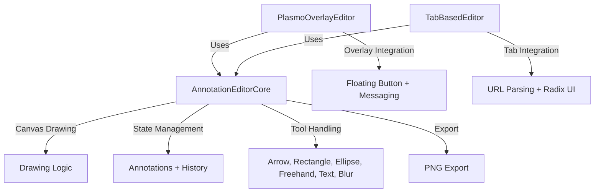

# Refactor Plan: Create Reusable Annotation Editor Component

## Project Overview
Refactor the Anno-Mark extension to create a shared, reusable annotation editor component that can be used in both the Plasmo overlay and the tab-based editor. This will eliminate code duplication and make maintenance easier.

## Current Issues
- **Code Duplication**: Both editors share 80-90% identical functionality but have separate implementations
- **Maintenance Overhead**: Changes to annotation logic require updates in two places
- **Inconsistent Behavior**: Potential for bugs and inconsistencies when features are implemented differently
- **Development Complexity**: New features require parallel development in both editors

## Goals
1. **Create a Shared Core Component**: Extract all annotation logic into a single reusable component
2. **Preserve Existing Functionality**: Maintain all current features and behavior
3. **Simplify Maintenance**: Changes apply to all uses of the editor
4. **Improve Consistency**: Ensure identical behavior across all integration scenarios
5. **Follow Plasmo Patterns**: Maintain compatibility with Plasmo's architecture

## Implementation Phases

### Phase 1: Create Shared Core Component
- **File**: `src/components/AnnotationEditorCore.tsx`
- **Tasks**:
  - [ ] Extract and define annotation types interface
  - [ ] Extract canvas drawing logic (arrow, rectangle, ellipse, freehand, text, blur)
  - [ ] Extract state management for annotations and history
  - [ ] Implement tool selection and color/brush size management
  - [ ] Extract undo/redo functionality
  - [ ] Implement export to PNG functionality
  - [ ] Create props interface for customization and integration
  - [ ] Add TypeScript type definitions

### Phase 2: Update Plasmo Overlay Editor
- **File**: `src/contents/plasmo-overlay.tsx`
- **Tasks**:
  - [ ] Remove duplicate annotation logic
  - [ ] Import and use the shared core component
  - [ ] Keep floating button and overlay integration logic
  - [ ] Style the floating button with Tailwind CSS
  - [ ] Implement message handling for capture workflow
  - [ ] Add auto-save functionality when editor is closed
  - [ ] Ensure proper integration with existing Plasmo overlay system

### Phase 3: Update Tab-Based Editor
- **File**: `src/tabs/editor.tsx`
- **Tasks**:
  - [ ] Remove duplicate annotation logic
  - [ ] Import and use the shared core component
  - [ ] Keep URL parameter parsing logic
  - [ ] Integrate with Radix UI styling
  - [ ] Implement export functionality
  - [ ] Test tab-based integration

### Phase 4: Integration & Testing
- **Tasks**:
  - [ ] Test both integration scenarios thoroughly
  - [ ] Verify all annotation tools work correctly
  - [ ] Test capture and export functionality
  - [ ] Verify undo/redo and history management
  - [ ] Test on different web pages and screen sizes
  - [ ] Optimize performance for large screenshots
  - [ ] Fix any bugs or inconsistencies

## Component Architecture

## Key Design Decisions

### 1. Props for Customization
The shared core component will accept props for:
- `imageData`: The base image to annotate
- `width`/`height`: Image dimensions
- `onExport`: Callback for export functionality (optional)
- `onClose`: Callback when editor is closed (optional)
- `exportButtonText`: Custom text for export button
- `showCloseButton`: Whether to show a close button

### 2. UI Framework Agnostic
The core component will focus on annotation logic and canvas rendering, leaving UI elements (toolbars, buttons) to integration components.

### 3. Event Handlers
Provide callbacks for:
- `onExport(dataUrl)`: When image is exported
- `onClose()`: When editor should be closed
- `onError(error)`: For error handling

### 4. Styling Strategy
- Core component will be unstyled (or use minimal inline styles)
- Integration components will handle all UI styling (Tailwind for overlay, Radix for tab)
- CSS classes will be customizable through props

## Files to Create/Modify

### New Files
- `src/components/AnnotationEditorCore.tsx` - Shared core editor component
- `src/components/AnnotationEditorCore.css` - Minimal styling for core component
- `src/types/annotations.ts` - Type definitions for annotation actions and history

### Files to Modify
- `src/contents/plasmo-overlay.tsx` - Update to use shared component
- `src/contents/plasmo-overlay.css` - Keep floating button styling
- `src/tabs/editor.tsx` - Update to use shared component
- `src/types/messages.ts` - May need minor updates for message handling

## Testing Strategy

1. **Unit Tests**: Test core annotation functionality
2. **Integration Tests**: Test both integration scenarios
3. **Regression Tests**: Verify all existing functionality works
4. **Performance Tests**: Ensure large screenshots render well
5. **Cross-Browser Tests**: Test on Chrome, Firefox, Safari

## Success Criteria

- [ ] Both editors share identical core functionality
- [ ] All annotation tools work correctly in both scenarios
- [ ] Capture and export functionality preserved
- [ ] Undo/redo and history management works
- [ ] No code duplication between editors
- [ ] Component is reusable and maintainable
- [ ] Build passes all TypeScript and linting checks

## Risks & Mitigation

| Risk | Mitigation |
|------|------------|
| Breaking existing functionality | Test thoroughly before implementation |
| Integration issues | Keep integration components simple and focused |
| Performance degradation | Optimize canvas operations and use virtualization if needed |
| Type errors | Use TypeScript strictly and verify with type checking |

## Timeline

- **Phase 1**: 2-3 hours
- **Phase 2**: 1 hour
- **Phase 3**: 1 hour
- **Phase 4**: 2-3 hours
- **Total**: 6-8 hours

This plan ensures a safe and systematic refactoring process that preserves all existing functionality while creating a reusable component architecture.
